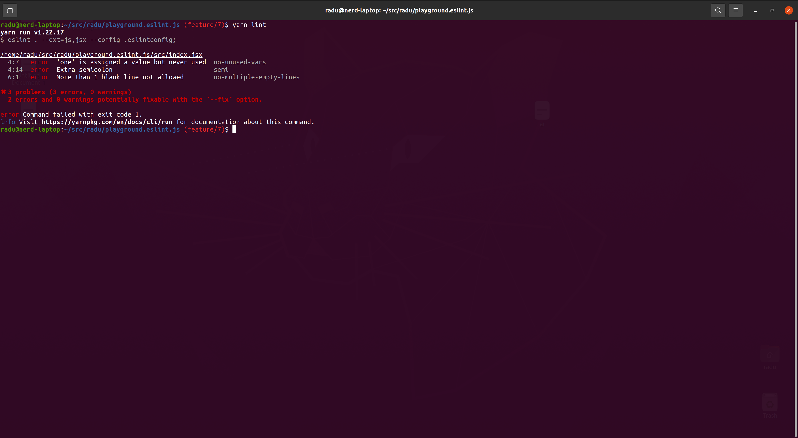

## Playground.ESLint.Frontend

An empty react app with frontend eslint configuration.

## Dependencies

Stuff needed to be met before starting the dev process.

- node v16.13.1
- yarn

## Run

Stuff needed to be done in order to start the project.

- Install the dependencies
  - `yarn`
- Lint the project
  - `yarn lint:fix`
- Start the project
  - `yarn start`
